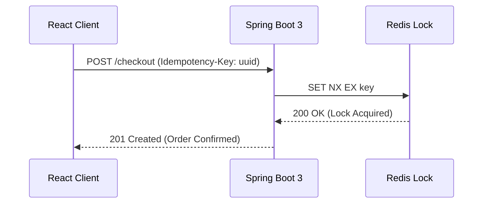

# Module 24.3 — Cross-Team Request For Comments (RFC) Process

## 1. WHAT
- **The RFC Process:** A formal collaborative mechanism used by Staff and Principal Engineers to propose major platform refactors, shared libraries, or cross-cutting infrastructural changes across multiple engineering squads.

---

## 2. ENTERPRISE RFC TEMPLATE

```markdown
# RFC: [Descriptive Feature or Architectural Proposal]

- **Author:** [Name & Squad]
- **Date:** YYYY-MM-DD
- **Target Release:** [e.g. Q4 2026]
- **Reviewers:** [Lead Architects, Security Lead, DevOps Lead]

---

## 1. Motivation & Problem Summary
*Why are we proposing this change? What business or architectural problem does it solve?*

---

## 2. Proposed Technical Design
*Detailed component architecture, state models, API contracts, and sequence diagrams:*


---

## 3. Security, Privacy & Compliance (OWASP Audit)
- Does this proposal touch PII, auth tokens, or payment gateways?
- How is CSRF/XSS mitigated?

---

## 4. Migration & Backward Compatibility
- How will existing squads adopt this change?
- Is there a phased rollout or feature flag?

---

## 5. Drawbacks & Alternatives Considered
- What are the risks of doing this?
- What happens if we do nothing?
```

---

## 3. EXPERT INTERVIEW QUESTIONS
1. *What distinguishes a fast ADR from a multi-week cross-team RFC?*
2. *How do you build consensus among dissenting engineering teams during an RFC debate?*
3. *What is the role of the Principal Architect in breaking deadlocks on RFC proposals?*
